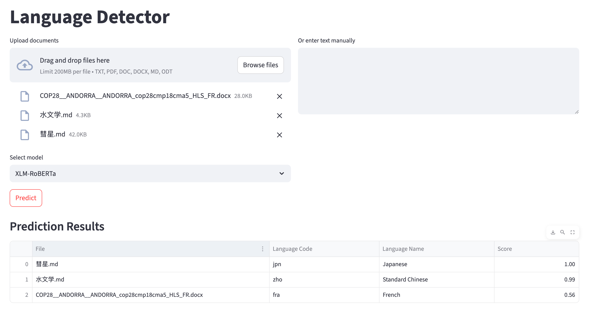

# Language Detector

This project is a full web application for language detection. Main components:
- Backend: FastAPI
- UI: `streamlit`
- Models:
    - Transformers: [XLM RoBERTa Small](https://huggingface.co/Unbabel/xlm-roberta-comet-small).
    - scikit-learn: `MultinomialNB` (Multinomial Naive Bayes).

Both models are trained using the [WiLI-2018 dataset](https://zenodo.org/records/841984) contains 235000 paragraphs of 235 languages, curated from Wikipedia.


## Folder structure

Here are a brief overview of the project's structure:

- `data/wili-2018`: Containing the WiLI-2018 dataset
- `docker`: Containing Docker-related files to build and run the Docker image for the frontend and backend of the app.
- `models`: Containing files of the trained Naive Bayes and fine-tuned XLM RoBERTa Small models.
- `scrips`: Containing scripts to train and evaluate the two models
- `src`:
    - `app`: The backend of the language detector app, exposing a single API endpoint for prediction
    - `detectors`: Containing detector classes used by the backend
    - `processors`: Containing functions to process text input for the frontend
    - `streamlit_ui`: A simple UI built with Streamlit
    - `utils`: Helper functions and schemas for input/output contents, to assist the communication between frontend and backend
    - `tests`: Unit tests for the API and two models.


## Manual Setup

The project can be installed using `uv` or `pip`. Here are the steps:

- Clone this project from the GitHub repo (or extract from the provided Zip file)
- Create a virtual environment using `venv`, `pyenv`, or `conda`, and activate the environment.

- **(Recommended)** Install required packages with [uv project manager](https://docs.astral.sh/uv/#installation):

```bash
# Install uv (MacOS, Linux)
curl -LsSf https://astral.sh/uv/install.sh | sh

# Install packages
uv sync --frozen

# Or, install the whole project in editable mode
uv pip install -e .
```

- Install with `pip`:

```bash
# Install packages
pip install -r requirements.txt

# Or, install the whole project in editable mode
pip install -e .
```

To run the app:

```bash
python run.py
```

The script with launch the application in a new browser tab.


## Setting up with Docker

To set up and run the app using Docker, for the first time you will need to build the image:

```bash
docker compose -f docker/compose.yaml build
```

To run the app after building:

```bash
docker compose -f docker/compose.yaml up
```

These `docker compose` commands will do the following:
- Build the Docker images for the backend and frontend services
- Run the two services in isolation

On the first run you can also combine the two commands like so:

```bash
docker compose -f docker/compose.yaml up --build
```


## Language detection

To perform language detection, you can upload files to the app (multiple files are acceptable). Supported file types are:

```python
SUPPORT_EXTENSIONS = ["txt", "pdf", "doc", "docx", 'md', "odt"]
```

Alternatively, you can also type in some texts into the text box. After that, you can select the model to be used for the detection task. Two supported models are XLM-RoBERTa Small (available via Hugging Face, fine-tuned for language detection) and NaiveBayes (implemented with `scikit-learn`).

After clicking "Predict", the app will take some time to load the model for the first time if it's not loaded yet. Then, the app will display the file, the language detected, and the score corresponding to the language.



# References

- Thoma, M. (2018). The WiLI benchmark dataset for written language identification. arXiv preprint arXiv:1801.07779.
- Conneau, A., Khandelwal, K., Goyal, N., Chaudhary, V., Wenzek, G., Guzmán, F., ... & Stoyanov, V. (2019). Unsupervised cross-lingual representation learning at scale. arXiv preprint arXiv:1911.02116.
- Mangla, P., Singh, G., Pathak, N., Chawla, S. (2024). Language Identification Using Multinomial Naive Bayes Technique. In: Swaroop, A., Polkowski, Z., Correia, S.D., Virdee, B. (eds) Proceedings of Data Analytics and Management. ICDAM 2023. Lecture Notes in Networks and Systems, vol 786. Springer, Singapore. https://doi.org/10.1007/978-981-99-6547-2_24

